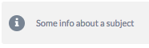

<h1>Syntax</h1>

The silverfin templating languages uses 3 kinds of tags:

* <a href="#print-tags">Print tags</a>
* <a href="#logic-tags">Logic tags</a>
* <a href="#layout-tags">Layout tags</a>

Each has its own purpose as explained below.

<h3 id="print-tags">Print tags</h3>

Print tags <code class="highlighter-rouge">{{ }}</code> are used to print variables on the screen.


  
    
// 

    {{ variable }}
  


  100



<h3 id="logic-tags">Logic tags</h3>

Logic tags <code class="highlighter-rouge"></code> are used for logic and control flows.


<pre>



    Hello world

    Bye World

</pre>


  Hello world



<h3 id="layout-tags">Layout tags</h3>

The Layout tags <code class="highlighter-rouge">{:: }</code> and <code class="highlighter-rouge">{:/ }</code> are used to adjust the layout within silverfin.


<pre>
{::infotext}
  Some info about a subject
{:/infotext}
</pre>


  



